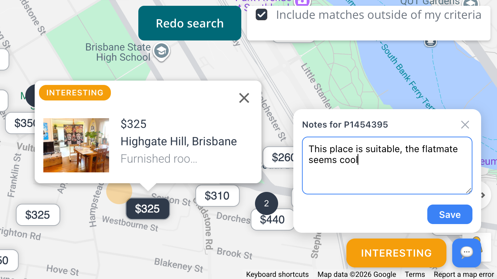

# Flatmates enhancer

## Goal

Provide extra features on flatmates.com to annotate details about listings.



## Privacy

This extension does not collect, transmit, or share any data. All annotations are stored locally in your browser via `browser.storage.local`.

## Features

Works on the flatmates.com.au **map view**. Click any property pin to see the toolbar in the bottom-right corner.

### Status tracking

Cycle through statuses by clicking the status button. The map pin is color-coded to match.

| Status      | Color     |
| ----------- | --------- |
| Unseen      | (default) |
| Unsuitable  | grey      |
| Interesting | orange    |
| Messaged    | green     |
| Rejected    | dark grey |

Note: The "map bubble status" (circle in the map of the color of the status) is imprecise, hopefully it's good enough.

### Private notes

Click the 💬 button to add free-text notes to any property. The icon turns blue when a property has notes. Notes are saved independently of status — you can have notes on an "unseen" property.

## Install

### Chrome / Brave (persistent)

1. Open `chrome://extensions` or `brave://extensions`
2. Enable **Developer mode** (toggle top-right)
3. Click **Load unpacked** → select this project folder
4. The extension persists across browser restarts

### Firefox (temporary)

1. Open `about:debugging#/runtime/this-firefox`
2. Click **Load Temporary Add-on** → select `manifest.json`
3. Extension is removed when Firefox closes — use `web-ext` for development instead

> For permanent Firefox install, the extension must be signed via [addons.mozilla.org](https://addons.mozilla.org).

## Development

### Run with auto-reload

**Firefox:**
```bash
npx web-ext run --source-dir .
```

**Chromium (Chrome/Edge/Brave):**
```bash
npx web-ext run --source-dir . --target chromium
```

Opens a temporary profile with the extension loaded. Auto-reloads on file changes.

### Storage persistence

Data is stored via `browser.storage.local`, which survives browser restarts. However, **how** you load the extension matters:

| Method                                       | Storage persists?                                                               |
| -------------------------------------------- | ------------------------------------------------------------------------------- |
| Chromium "Load unpacked"                     | Yes — stable extension ID                                                       |
| Firefox `about:debugging` (temporary add-on) | **No** — extension ID changes each load, so storage is lost when Firefox closes |
| `web-ext run`                                | Yes, if you reuse the same profile (default behaviour)                          |
| Signed / installed extension                 | Yes                                                                             |

### Lint

```bash
npx web-ext lint
```

## Tech

* Browser extension (Manifest V3, works in Firefox and Chromium)
* `browser.*` APIs
* Plain JS/HTML/CSS — no build step
* Data persists in `browser.storage.local`

> Vibe coded with Claude Code
